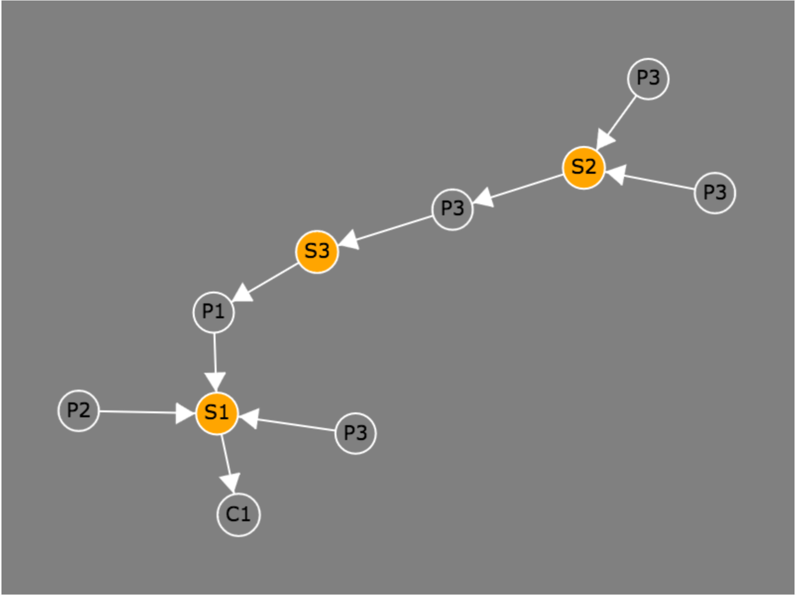
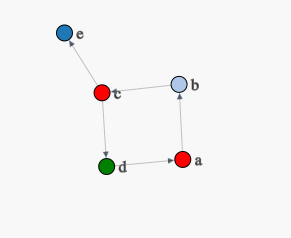
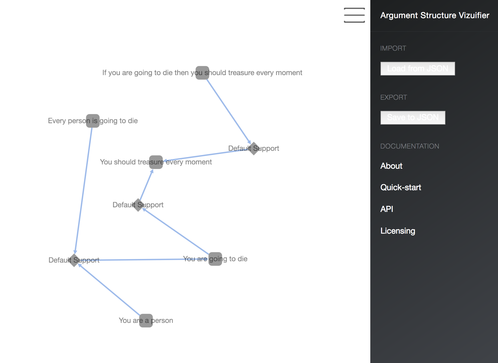

Some experiments using various JS based libraries to explore different ways to interact with & visualise argument data.

v1 - JQuery & Arbor
===================

An argument vizualisation widget that uses HTML 5 Canvas, JQuery, Jquery UI, Jquery Arbor, & JQuery SimpleModal. The aim is to provide beautiful online illustrations of argument structure to make clear the patterns of reasoning used in online argument and dialogue.

This is a simple visualisation that includes nodes and edges with text labels for nodes. A modal is used to display information about indivdual nodes. Orange nodes depict schemes and grey nodes depict information.

v2 - d3.js
==========

A widget using d3.js

This version incorporates additional features above v1 to enable the user to interact with the dynamic layout engine.

* t - toggle whether text label of selected node is displayed
* s - toggle whether the selected node is scaled larger than the default size. This enable a user to select a trail of nodes through the visualisation.
* f - toggle whether the selected node is fixed in place or allowed to move as the layout engine redraws the visualisation

Nodes are coloured as follows:

* Info - Light Blue
* Rule Application Node - Green
* Conflict Applciation Node - Red
* Scheme Archetype (Default) - Grey
* Everything else - Blue

v3 - cytoscape.js
=================

A widget that uses cytoscape.js to visualise arguments.

Getting Started
===============

Open a terminal, navigate to the folder containing the visualisation script that you want to run, e.g. v1, v2, v3, etc. then start a simple Python HTTP server to serve up the folder locally, e.g. 

    $ python -m SimpleHTTPServer 8910

then head to [http://localhost:8910](http://localhost:8910)

